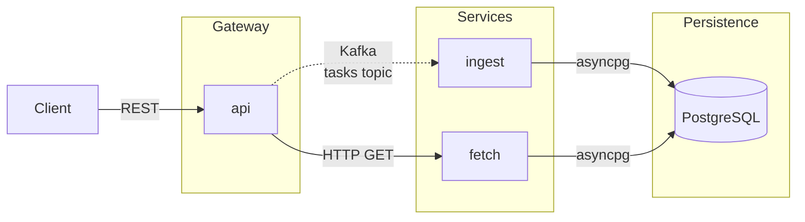

# Task Manager

A task management backend built as three cooperating Python microservices in a mono-repo.

## Overview




| Service | Role | Port |
|---|---|---|
| **api** | REST gateway — accepts client requests, publishes Kafka events for writes, calls `fetch` for reads | 8000 |
| **ingest** | Kafka consumer — processes task events and persists them to PostgreSQL | — |
| **fetch** | Retrieval service — serves read queries directly from PostgreSQL | 8002 (internal) |


## API

All public endpoints are on **api** at `http://localhost:8000`.

| Method | Path | Description | Response |
|---|---|---|---|
| `POST` | `/tasks` | Create a task | `202 Accepted` · `{"task_id": "<uuid>"}` |
| `GET` | `/tasks` | List all tasks | `200 OK` · array of task objects |
| `GET` | `/tasks/{id}` | Get a task by ID | `200 OK` · task object · `404` if not found |
| `PUT` | `/tasks/{id}` | Partial update (any field) | `202 Accepted` · `{"task_id": "<uuid>"}` |
| `DELETE` | `/tasks/{id}` | Delete a task | `202 Accepted` · `{"task_id": "<uuid>"}` |

**Task object:**
```json
{
  "id": "uuid",
  "title": "string",
  "description": "string | null",
  "status": "pending | in_progress | done",
  "created_at": "2024-01-01T00:00:00Z",
  "updated_at": "2024-01-01T00:00:00Z"
}
```

> Write endpoints return `202 Accepted` because the database write is asynchronous (via Kafka). Allow a brief moment before a newly created or updated task appears in read responses.

### Swagger UI

With the stack running, the API is self-documenting via FastAPI's built-in OpenAPI support:

| URL | Description |
|---|---|
| http://localhost:8000/docs | Swagger UI — interactive, try requests in the browser |
| http://localhost:8000/redoc | ReDoc — alternative read-only documentation view |
| http://localhost:8000/openapi.json | Raw OpenAPI schema (JSON) |

Swagger UI lets you expand any endpoint, view its request/response schema, and execute requests directly — no curl or Postman needed.

## Project Structure

```
devsecops/
├── .claude/                  # Claude Code slash commands (/docker-build, /test-all, /logs)
├── .devcontainer/            # VS Code Dev Container config and dev image Dockerfile
├── docs/                     # Extended documentation
├── infra/
│   └── db/
│       └── init.sql          # PostgreSQL schema (tasks table + updated_at trigger)
├── services/
│   ├── api/                  # Gateway: FastAPI REST API, Kafka producer, HTTP client to fetch
│   ├── ingest/               # Ingestion: Kafka consumer, asyncpg writes to PostgreSQL
│   └── fetch/                # Retrieval: FastAPI read-only API, asyncpg queries
├── CLAUDE.md                 # Project conventions and context for Claude Code
├── docker-compose.yml        # Full-stack orchestration (all services + Kafka + PostgreSQL)
└── README.md
```

Each service directory shares the same layout:

```
service-name/
├── src/              # Python package (application source)
├── tests/            # pytest unit tests
├── Dockerfile        # Container image definition
└── pyproject.toml    # Project metadata, dependencies, and pytest configuration
```

## Tech Stack

| Component | Technology |
|---|---|
| Services | Python 3.12, FastAPI, uvicorn |
| Async DB client | asyncpg |
| Messaging | Apache Kafka (KRaft mode) |
| Database | PostgreSQL 16 |
| Containerisation | Docker, Docker Compose v2 |
| Development | VS Code Dev Containers |

## Developer Guide

### Prerequisites

- [Docker Desktop](https://www.docker.com/products/docker-desktop/) (or Docker Engine + Compose v2)
- [VS Code](https://code.visualstudio.com/) with the [Dev Containers extension](https://marketplace.visualstudio.com/items?itemName=ms-vscode-remote.remote-containers)

### Local Dev Setup

1. Clone the repo and open it in VS Code.
2. When prompted, click **Reopen in Container** — or run **Dev Containers: Reopen in Container** from the command palette (`⇧⌘P`).
3. VS Code builds the dev container and starts all infrastructure (Kafka, PostgreSQL) automatically. The `postCreateCommand` installs all Python dependencies — no virtual environment is used.
4. The following ports are forwarded to your host:

| Port | Service | Purpose |
|---|---|---|
| 8000 | api | REST API and Swagger UI |
| 8002 | fetch | Internal read service (also accessible from host) |
| 5432 | postgres | PostgreSQL database |
| 9092 | kafka | Kafka broker |

For detailed workflows see [docs/developer-guide.md](docs/developer-guide.md).
