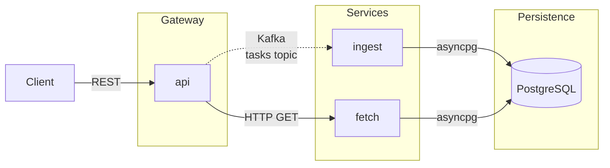

# Task Manager

A task management REST API built as three cooperating Python microservices. 

## Architecture

Clients interact through a single API endpoint; writes are acknowledged immediately and processed asynchronously via Kafka, while reads are served directly from PostgreSQL.

| Service | Role | Port |
|---|---|---|
| **api** | Public REST gateway — accepts requests, publishes Kafka events for writes, proxies reads to `fetch` | 8000 |
| **ingest** | Kafka consumer — processes task events and persists them to PostgreSQL | — |
| **fetch** | Internal read service — serves queries directly from PostgreSQL | 8002 (internal) |

> **Write behaviour:** mutation endpoints (`POST`, `PUT`, `DELETE`) return `202 Accepted` immediately with a `task_id`. The database write happens asynchronously via Kafka, so a newly created task may not appear in read responses for a brief moment.

## Documentation

| | |
|---|---|
| [API Reference](docs/api-reference.md) | Endpoints, schemas, Swagger UI, curl examples |
| [Developer Guide](docs/developer-guide.md) | Environment setup, day-to-day workflows, local Kubernetes |
| [CI/CD Reference](docs/ci-cd.md) | Pipeline jobs, security gates, GitOps workflow |
| [Tech Stack](docs/tech-stack.md) | Languages, frameworks, and tooling |
| [Project Structure](docs/project-structure.md) | Repository layout |
| [Port Mappings](docs/port-mappings.md) | Host ports and network topology |
