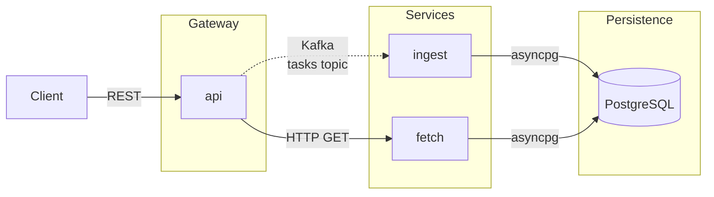

# Task Manager

A task management REST API built as three cooperating Python microservices. 

## Architecture

Clients interact through a single API endpoint; writes are acknowledged immediately and processed asynchronously via Kafka, while reads are served directly from PostgreSQL.



| Service | Role | Port |
|---|---|---|
| **api** | Public REST gateway — accepts requests, publishes Kafka events for writes, proxies reads to `fetch` | 8000 |
| **ingest** | Kafka consumer — processes task events and persists them to PostgreSQL | — |
| **fetch** | Internal read service — serves queries directly from PostgreSQL | 8002 (internal) |

> **Write behaviour:** mutation endpoints (`POST`, `PUT`, `DELETE`) return `202 Accepted` immediately with a `task_id`. The database write happens asynchronously via Kafka, so a newly created task may not appear in read responses for a brief moment.

## Quick start

**Getting started** — after cloning the repo:

```bash
bash dev.sh setup          # install host tools (once per machine / once per clone)
# then open project directory in VS Code and click "Reopen in Container"
# VSCode starts all services automatically via Docker Compose
bash dev.sh check          # verify the stack is up and the API is responding
bash dev.sh -h             # list all available dev.sh commands
```

Once the stack is up, the API is available at `http://localhost:8000`. Open `http://localhost:8000/docs` for Swagger UI — an interactive browser interface where you can explore and call every endpoint without any tooling.

**Day-to-day development** — the project uses a VS Code dev container: when you open the repo in VS Code, your editor and terminal run inside a Docker container that has all dependencies pre-installed. Services support hot reload — save a `.py` file and the service restarts automatically. Use `bash dev.sh test` (inside the VS Code terminal) to run tests, and `bash dev.sh scan` (from either terminal) to run security scans — it detects which tools are available in the current environment and runs the appropriate checks.

**Two ways to run locally** — `bash dev.sh up` (port 8000) is for day-to-day development. `bash dev.sh up-kind` (port 8080) provisions a local Kubernetes cluster and is only needed when validating the CI/CD pipeline end-to-end; most developers will never need it.

**Write behaviour** — write operations (`POST`, `PUT`, `DELETE`) return immediately with a `task_id` before the data has been saved. Writes are queued through Kafka and persisted asynchronously, so a newly created or updated task may not appear in read responses for a brief moment.

Full details in the docs:

| | |
|---|---|
| [API Reference](docs/api-reference.md) | Endpoints, schemas, Swagger UI, curl examples |
| [Developer Guide](docs/developer-guide.md) | Environment setup, day-to-day workflows, local Kubernetes |
| [CI/CD Reference](docs/ci-cd.md) | Pipeline jobs, security gates, GitOps workflow |
| [Tech Stack](docs/tech-stack.md) | Languages, frameworks, and tooling |
| [Project Structure](docs/project-structure.md) | Repository layout |
| [Port Mappings](docs/port-mappings.md) | Host ports and network topology |
