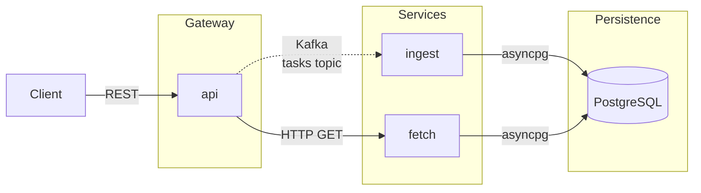

# Task Manager

A task management backend built as three cooperating Python microservices in a mono-repo.

## Overview

| Service | Role | Port |
|---|---|---|
| **api** | REST gateway — accepts client requests, publishes Kafka events for writes, calls `fetch` for reads | 8000 |
| **ingest** | Kafka consumer — processes task events and persists them to PostgreSQL | — |
| **fetch** | Retrieval service — serves read queries directly from PostgreSQL | 8002 (internal) |

## API

See [docs/api-reference.md](docs/api-reference.md) for all endpoints, request/response schemas, and Swagger UI links.

## Running Locally

Prerequisites: [Docker Desktop](https://www.docker.com/products/docker-desktop/) and [VS Code](https://code.visualstudio.com/) with the [Dev Containers extension](https://marketplace.visualstudio.com/items?itemName=ms-vscode-remote.remote-containers).

1. Clone the repo and open it in VS Code.
2. When prompted, click **Reopen in Container** (or run **Dev Containers: Reopen in Container** from `⇧⌘P`).
3. VS Code starts all six containers on a shared Docker network: `postgres`, `kafka`, `api`, `fetch`, `ingest`, and the dev container itself (the shell VS Code attaches to). All services are running by the time the window opens.

API available at **`http://localhost:8000`** · Swagger UI at **`http://localhost:8000/docs`**

> **How it fits together:** The dev container is not where the services run — it is a persistent shell container that VS Code attaches to for your terminal and editor. The three application services (`api`, `fetch`, `ingest`) run in their own containers with live source mounts, so code changes are reflected immediately without rebuilding. If you need to restart a stopped service or rebuild after a Dockerfile change, run `docker compose up` from a **host machine terminal** (iTerm, macOS Terminal, etc.) — not from the VS Code terminal, which runs inside the dev container and resolves paths incorrectly for volume mounts.

For full setup instructions and day-to-day workflows see [docs/developer-guide.md](docs/developer-guide.md).

## Further Reading

| Document | Description |
|---|---|
| [docs/api-reference.md](docs/api-reference.md) | Endpoint reference and Swagger UI |
| [docs/ci-cd.md](docs/ci-cd.md) | CI/CD pipeline and GitOps workflow |
| [docs/developer-guide.md](docs/developer-guide.md) | Full developer workflows for both deployment modes |
| [docs/port-mappings.md](docs/port-mappings.md) | Host port assignments and network topology |
| [docs/project-structure.md](docs/project-structure.md) | Repository layout and tech stack |
