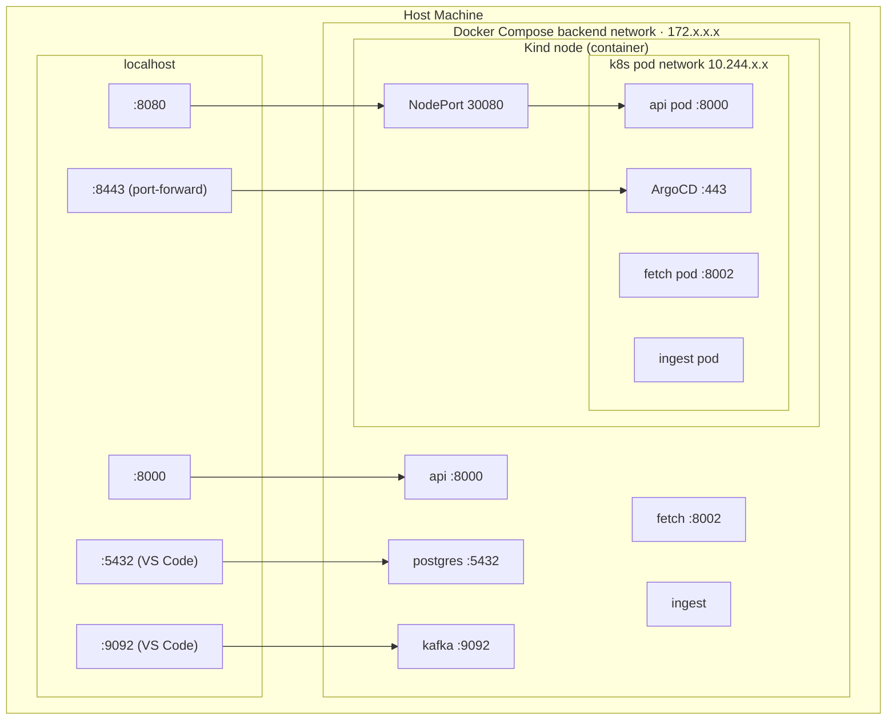

[← README](../README.md)

# Port Mappings

## Host port assignments

### Mode 1 — Docker Compose

| Host port | Service | How exposed | Notes |
|---|---|---|---|
| **8000** | api | `ports:` bind in `docker-compose.yml` | REST API, Swagger UI |
| **8002** | fetch | VS Code `forwardPorts` via devcontainer | Internal read service |
| **5432** | postgres | VS Code `forwardPorts` via devcontainer | PostgreSQL |
| **9092** | kafka | VS Code `forwardPorts` via devcontainer | Kafka broker |

fetch, postgres, and kafka have no `ports:` binding in Docker Compose — they are
internal to the `backend` network. VS Code tunnels them to your host while the
devcontainer is attached.

### Mode 2 — Kind (local Kubernetes)

| Host port | Service | How exposed | Notes |
|---|---|---|---|
| **8080** | api | Kind NodePort 30080 → `extraPortMappings` in kind-config.yaml | REST API |
| **8443** | ArgoCD | On-demand `kubectl port-forward` | ArgoCD UI (HTTPS) |

```bash
kubectl port-forward svc/argocd-server -n argocd 8443:443
```

## Network topology

The two deployments run in separate network namespaces and do not interfere with
each other. Both can be running simultaneously without port conflicts on the host
(api is reachable at `:8000` via Docker Compose and `:8080` via Kind).

```
YOUR HOST MACHINE
├── host network  (localhost)
│     :8000  ──► Docker Compose api
│     :8080  ──► Kind api  (via NodePort 30080)
│     :5432  ──► postgres  (VS Code forwardPorts)
│     :9092  ──► kafka     (VS Code forwardPorts)
│     :8443  ──► ArgoCD    (on-demand kubectl port-forward)
│
├── Docker Compose  [devsecops_backend bridge network ~172.x.x.x]
│     api        172.x.0.2:8000
│     fetch      172.x.0.3:8002
│     postgres   172.x.0.4:5432
│     kafka      172.x.0.5:9092
│     ingest     172.x.0.6  (no port)
│     Kind node  172.x.0.7  ◄── also joined to this network
│                            so pods can reach postgres/kafka by name
│
└── Kind node container  (a Docker container on the backend network)
      └── Kubernetes pod network  [separate overlay ~10.244.x.x]
            api pod     10.244.0.x:8000
            fetch pod   10.244.0.x:8002
            ingest pod  10.244.0.x  (no port)
            │
            └── NodePort 30080 on Kind node ──► host:8080
```



The internal ports (8000, 8002) appear in both namespaces but are fully isolated
from each other — they are in different network namespaces and cannot clash.

The Kind node is the only container bridged into both networks, intentionally:
pods need to resolve `postgres` and `kafka` by their Docker Compose service names
without any configuration changes. Traffic flows one way only — pods reach out to
Docker Compose services, not the reverse.
